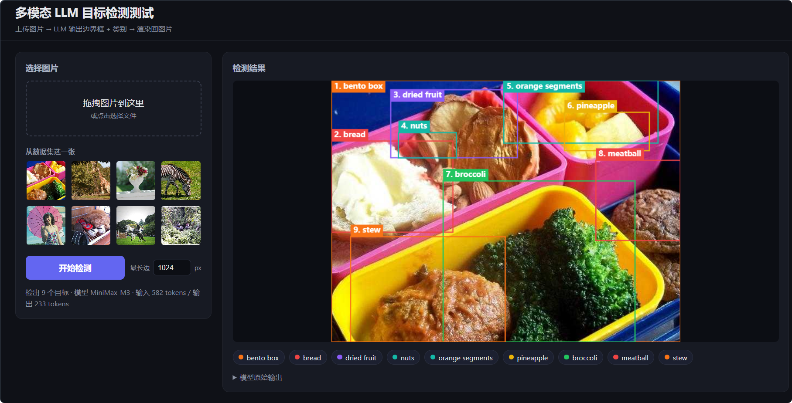

# Vision Test

> **A quick playground for testing your multimodal LLM's object-detection ability.**
> Upload an image, the model returns bounding boxes + class names, and the boxes are drawn back onto your original picture.



---

## Why this exists

If you're building with multimodal LLMs (Claude, GPT-4o, Gemini, …) and want a **fast, no-fuss way to answer one question** — *"can this model actually find objects in images, and how well?"* — this is it.

Most "vision tests" today mean: write Python, set up an inference client, draw boxes with matplotlib, debug JSON parsing for an hour. **This repo is the 30-second version.** One command, one browser tab, one picture in, results out.

It's intentionally a demo, not a production system:

- ✅ No model training, no fine-tuning, no eval harness
- ✅ Just: **your image → your model → boxes on your image**
- ✅ Same image, swap models in one click — eyeball which one is better

## Features

- 🖼️ **Drag-drop or pick a file** (JPEG / PNG / WebP / GIF)
- 📦 **8 sample images** from the COCO dataset pre-loaded — pick one and try it now
- 🤖 **Pluggable LLM providers**: Anthropic Claude, OpenAI-compatible (GPT-4o, OpenRouter, any local proxy, …)
- 🔄 **Live model switching** — change model / API key / base URL in the browser, no restart
- 📐 **Smart image compression** — the image is downscaled to a configurable max edge before being sent to the model, saving tokens and bandwidth without losing detection accuracy
- 🎯 **Boxes drawn on the original full-resolution image** — so you can visually compare detection quality against the source
- 🏷️ **Class color-coding** — same class always gets the same color, easy to compare across runs

## 5-minute quickstart

### 1. Get the code

```bash
git clone https://github.com/ZeroTang05/vision-test.git
cd vision-test
npm install
```

### 2. Run it

```bash
npm start
```

You'll see:

```
vision-test 已启动: http://localhost:3000
支持 Provider: anthropic / openai
  → 在页面右上角「设置」里随时切换 provider / 模型 / Key，无需重启
```

### 3. Open the browser

Visit **http://localhost:3000**.

### 4. Configure your provider

Click the ⚙️ gear icon in the top-right corner, pick **Anthropic** or **OpenAI-compatible**, and fill in:

| Field | What to put |
|---|---|
| API Key | your provider's key (e.g. `sk-ant-…` or `sk-…`) |
| Model | any vision-capable model name (e.g. `claude-sonnet-5`, `gpt-4o`) |
| Base URL | _optional_ — leave blank for official; fill in for proxies/alternatives |

Click **保存**. Your settings are saved to `localStorage`; you won't be asked again.

> ⚠️ **Heads up:** the API key is stored in your browser's localStorage in plain text. That's fine for local tinkering, **not** for shared machines or production. For production, route through a proper backend with secrets in env vars.

### 5. Pick a picture and run detection

- Drop a picture into the upload zone, **or**
- Click one of the 8 sample thumbnails

Hit **开始检测**, wait a few seconds, and your model-drawn bounding boxes will appear on the right.

## What "good detection" looks like

In the screenshot at the top: the model was asked to find every notable object in a bento-box photo. It returned **9 boxes** (bento box, bread, dried fruit, nuts, orange segments, pineapple, broccoli, meatball, stew) and they line up tightly with what you'd call the objects in the picture.

That's the bar. If your model returns 1 box where you expected 9, or boxes that miss obvious targets, you have your answer: this model isn't great at detection on this image type.

## How it works (1-minute tour)

```
Browser                       Server (server.js)              LLM API
  │ upload (or sample) ───────▶  GET /api/samples               │
  │                             │                                │
  │ ◀──── thumbnails list ──────│                                │
  │                             │                                │
  │ click "Detect"              │                                │
  │ ────────────────────────────▶ POST /api/detect              │
  │                             │  ① compress image to ≤1024px  │
  │                             │  ② call provider's SDK        │
  │                             │ ──────────────────────────────▶│
  │                             │ ◀──── JSON: [{name, bbox_2d}] ─│
  │ ◀── boxes + raw text ──────│                                │
  │ canvas draws boxes on the   │                                │
  │ ORIGINAL (uncompressed)     │                                │
  │ image                       │                                │
```

Two design choices worth knowing:

**0–1000 normalized coordinates.** The model is told to return boxes as integers in `0..1000` instead of raw pixels. This is the recommended way to ask multimodal models for bounding boxes — it's robust against the model's internal image resizing. The frontend then scales these back to the original image's pixel dimensions for drawing. So you get pixel-accurate boxes **on the original image**, not on the downscaled one the model actually saw.

**Compression on send, draw on original.** The image is downscaled before being sent to the model (configurable, default 1024px max edge). This saves tokens and bandwidth, often by 5–10×. The bounding boxes are then drawn on the original full-resolution image — so even tiny compression artifacts can't shift your boxes.

## Configuration reference

### Browser-side (saved to localStorage)

| Field | Default | Notes |
|---|---|---|
| Provider | `anthropic` | `anthropic` or `openai` |
| API Key | _required_ | Plain text, browser-side only |
| Model | _required_ | Any vision-capable model name |
| Base URL | _empty = official_ | For proxies (OpenRouter, self-hosted, …) |
| Max edge | `1024` | Images larger than this are downscaled before sending to the model |

### Server-side (env vars, optional)

If you'd rather not type your API key into a browser, set these in a `.env` file instead:

```bash
# Anthropic
ANTHROPIC_API_KEY=sk-ant-…
MODEL=claude-sonnet-5
ANTHROPIC_BASE_URL=https://api.anthropic.com  # or a proxy

# OpenAI / OpenAI-compatible
OPENAI_API_KEY=sk-…
OPENAI_MODEL=gpt-4o
OPENAI_BASE_URL=https://api.openai.com/v1  # or a proxy
```

Server env vars are **fallback** — if the browser sends a key, that wins. This lets you mix and match: hardcode the base URL on the server (don't trust the client with it), let the user pick the model and key in the browser.

## Tested with

- Anthropic Claude Sonnet 5 / Sonnet 4.5 / Opus 4.8
- OpenAI GPT-4o / GPT-4o-mini / GPT-5
- OpenAI-compatible proxies (OpenRouter, MiniMax, self-hosted gateways)

If you find a provider that needs special handling, open an issue.

## Project layout

```
vision-test/
├── server.js              ← Express server + provider adapters
├── package.json
├── public/
│   ├── index.html         ← UI
│   ├── style.css
│   └── app.js             ← Browser logic + localStorage config
├── datasets/coco8/        ← 8 sample images (COCO val) + YOLO-format labels
└── README/
    └── main.png           ← README screenshot
```

The `datasets/coco8/` directory contains the official Ultralytics mini-COCO dataset (8 images) with human-annotated YOLO-format labels in `labels/`. Useful if you want to quantitatively compare a model's output against ground truth.

## Troubleshooting

<details>
<summary><b>Click ⚙️ then ×, nothing happens / I can't close the panel</b></summary>

Reload the page. This used to be a CSS bug where the modal's `display: flex` overrode the HTML `hidden` attribute; it's fixed.
</details>

<details>
<summary><b>403 "Request not allowed" from the model</b></summary>

The model name isn't enabled for your account, or your API key doesn't have access. Check the **Models** page in your provider's console for the exact spelling.
</details>

<details>
<summary><b>Boxes land slightly off the objects</b></summary>

Either your model isn't very good at this image, or the image was downscaled a lot. Try lowering **Max edge** to `2048` or higher and re-run.
</details>

<details>
<summary><b>413 / payload too large</b></summary>

The server accepts up to 20 MB JSON bodies (covers ~15 MB images after base64). For larger files, lower **Max edge** in the UI or pre-resize externally.
</details>

<details>
<summary><b>"Failed to fetch" in the browser</b></summary>

The local server isn't running. The browser cannot call LLM APIs directly (CORS), so the backend must be up.
</details>

## Contributing

Issues and PRs welcome. The whole thing is ~600 lines of code (server + frontend); there's plenty of room for:

- More providers (Gemini, Qwen-VL, …)
- Batch evaluation (run on the whole COCO8 set, score against the labels)
- Per-class precision/recall metrics
- Export detection results as JSON / COCO format

## License

MIT — see [LICENSE](LICENSE).
